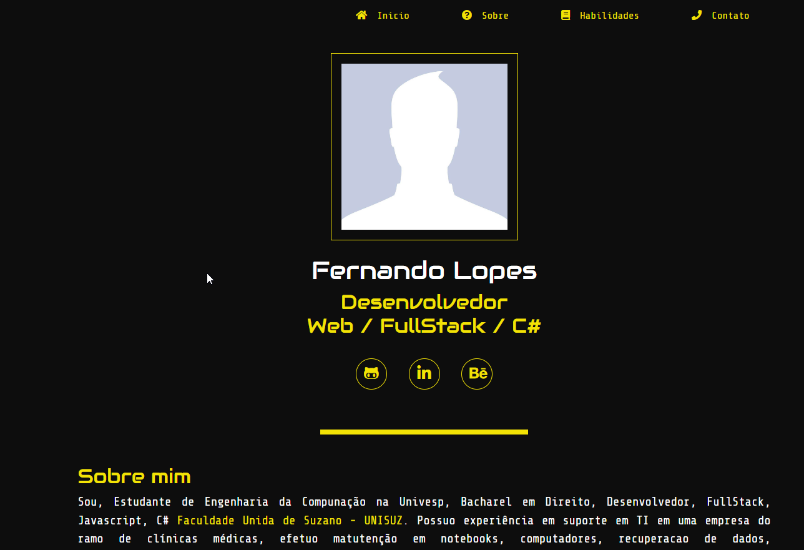

# 🕹 Criação de Portifolio
> Criando um portifolio utilizando JavaScript / CSS / HTML

## 📋 Índice
- [Link do projeto:](https://finandolopes.github.io/Portifolio/)

- [📖 Sobre](#-Sobre)
- [🚀 Tecnologias utilizadas](#-Tecnologias-utilizadas)
- [🖥 Preview](#-Preview)
- [📌 Créditos](#-Créditos)

## 📖 Sobre
 - Criação do Site Reddot 

## 🚀 Tecnologias utilizadas
- `JAVASCRIPT`
- `HTML`
- `CSS`

## 🖥 Preview:

  

   

